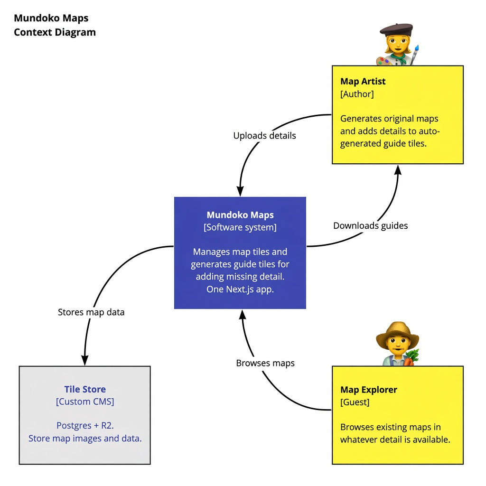
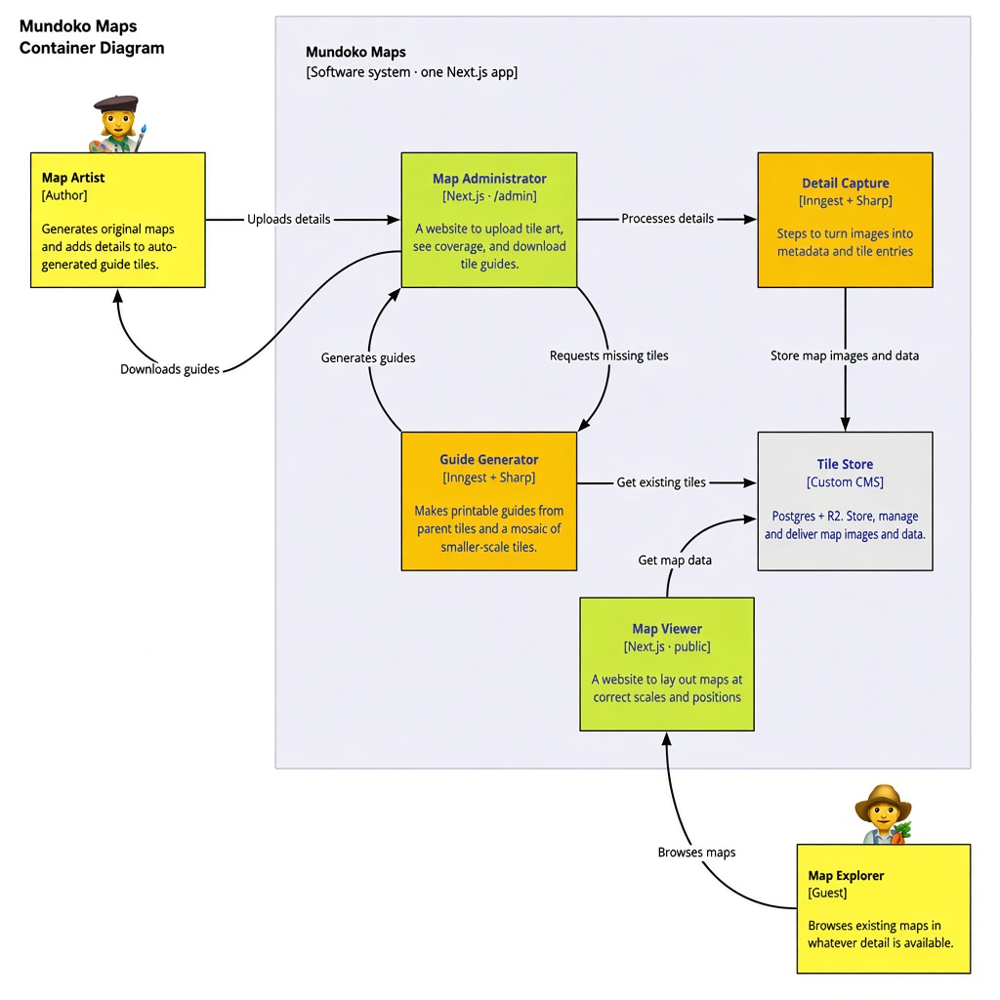

# 🧙🏾‍♀️ Mundoko Maps 🗺

Hand made, automagical technology for mapping a fantasy city

---

ℹ️ **Pre-alpha** means this really isn't ready for public use but we'd love collaboration 👍

---

For a typical "Getting Started" [README](/app/README.md) head into [`./Mundoko-Maps`](./Mundoko-Maps/) for the code etc. 💻

---

## Why 🧮 👩‍🎨 🪐

1. Story based games benefits from half decent maps and _locational consistency_
2. Personally I love drawing maps and creating an imaginary world
3. Open-source means we can share knowledge, resources and all that good stuff

## What 🐉 ⚔️ 🎲

- [x] **Pathfinder** and **Dungeons & Dragons** compatible units and scales
- [x] A highly opinionated grid, scale, co-ordinate and page-size system worked out
- [ ] Details of the grid, scale, co-ordinate and page-size system, publically available
- [ ] Software to navigate these maps publically through a web browser
- [ ] Software to generate templates for drawing the missing maps or retouching the existing ones
- [ ] Millions of map tiles drawn based on this system, from extra-global scale right down to floorplans

## Notes 📝 👨🏿‍💻 🔭

1. This is a hobby project, practicing async, laid-back communication
1. We're building software to supports people who want to hand-draw maps of their imaginary worlds
1. And we're using the software to help us map our own fantasy world at [**maps.mundoko.world**](https://maps.mundoko.world)
1. This system is designed to be compatible with [Pathfinder](https://en.wikipedia.org/wiki/Pathfinder_Roleplaying_Game) and may well translate to [Dungeons & Dragons](https://en.wikipedia.org/wiki/Dungeons_%26_Dragons) and other table top RPGs

### Tech Vision

A couple of pictures to help visualise who will use this tech and how the different parts of it will interact with one another. These are updated from the original Miro C4 sketches: Tile Store is a **custom CMS** (Postgres + R2, not Contentful), capture and guides run on **Inngest + Sharp** (not AWS Step Functions), and explorers browse through Mundoko Maps rather than hitting the store directly.

#### System context

#### Containers in the system

None of this has been built yet. It's still in the early days of ideation.

### Architecture plan

The greenfield design (tech choices, cost, and a build order for a solo / shoestring project) lives in [`docs/architecture/`](./docs/architecture/README.md):

- [System design](./docs/architecture/01-system.md)
- [Domain kernel](./docs/architecture/domain-kernel.md) (scales and nestings)
- [Tile Store](./docs/architecture/containers/tile-store.md) (custom CMS — not Contentful)
- [Map Viewer](./docs/architecture/containers/map-viewer.md)
- [Map Administrator](./docs/architecture/containers/map-administrator.md)
- [Detail Capture](./docs/architecture/containers/detail-capture.md)
- [Guide Generator](./docs/architecture/containers/guide-generator.md)
