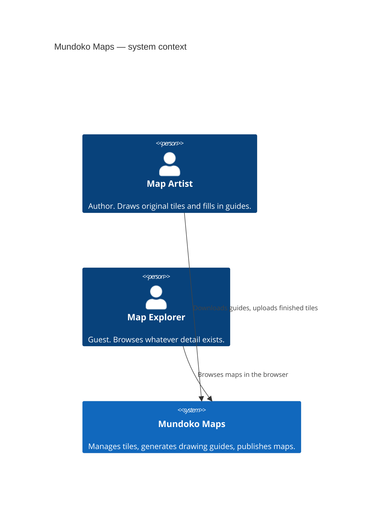
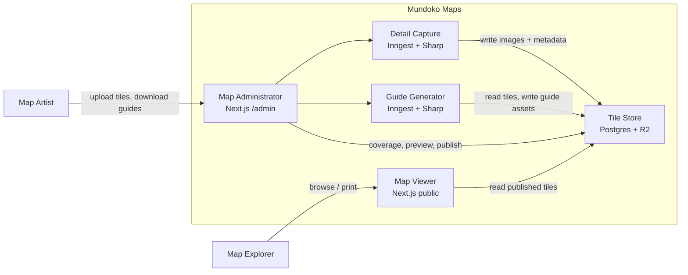

# System design — Mundoko Maps

Hand-drawn, automagical technology for mapping a fantasy city.

This is the high-level plan for the whole product: who uses it, which containers exist, which technology each one uses, what it costs, and the order to build it. Container-level detail lives in the sibling docs under [`containers/`](./containers/).

## 1. Purpose

Story games need maps that stay consistent as you zoom from a continent down to a five-foot floorplan. Mundoko Maps is opinionated software around that problem:

- An **artist** draws original map tiles on paper (or digitally) using auto-generated **guides** that show what already exists at the scale above and below.
- The system **captures** those drawings as tiles with coordinates, scale, and images.
- An **explorer** browses the world in a browser, at whatever detail has been drawn so far.

It is designed around Pathfinder / D&D units (feet and miles) and a physical **20cm × 20cm** tile that fits on A4 and US Letter paper.

## 2. Design constraints

These constraints outrank architectural fashion.

| Constraint | What it means in practice |
| --- | --- |
| Solo builder | One deployable. One language (TypeScript). One database. Shared domain types. No microservices, no k8s, no “platform team” tools. |
| Shoestring budget | Target **$0–15/month**. Free tiers first. No Contentful, no AWS Step Functions, no Mapbox. Paid upgrades only when a free tier is actually on fire. |
| Hobby cadence | Architecture must survive weeks of inactivity. Boring, documented, restartable. |
| Highly opinionated grid | The coordinate system is the product. Do not generalise into a GIS. |
| Millions of *possible* tiles | The world grid is huge. Almost all squares are empty. **Do not store empty tiles.** Compute absence. |
| One artist first | Auth is an allowlist, not a multi-tenant CMS. Collaboration, roles, and orgs are non-goals for v1. |

## 3. System context

Two people, one software system, one store of map images and data.



The original vision had explorers talking **directly** to a CMS (Contentful) and the artist talking to Mundoko Maps. That split is dropped. On a shoestring, one app serves both audiences and owns the store. Explorers never see a CMS UI; they hit a public viewer that reads the Tile Store.

```text
Map Artist ──► Mundoko Maps ──► Tile Store (custom)
                    ▲                    │
                    │                    │
              Map Explorer ◄─────────────┘
              (via Map Viewer, not raw storage)
```

## 4. Containers

Five containers, matching the vision diagram, implemented as **modules in one application** rather than five services.



| Container | Kind | One-line job |
| --- | --- | --- |
| [Tile Store](./containers/tile-store.md) | Custom CMS | Store, manage, and deliver map images and tile records. |
| [Map Viewer](./containers/map-viewer.md) | Public UI | Lay out maps at the correct scale and position. |
| [Map Administrator](./containers/map-administrator.md) | Author UI | Upload tile art, inspect coverage, download guides. |
| [Detail Capture](./containers/detail-capture.md) | Background jobs | Turn an uploaded image into metadata + tile assets. |
| [Guide Generator](./containers/guide-generator.md) | Background jobs | Compose a printable guide from parent and/or child tiles. |

A sixth *logical* piece is not a container: the **shared domain kernel** (scales, coordinates, parent/child math, tile identity). It is a TypeScript package imported by every container. Get this right first; everything else is plumbing.

### 4.1 Why a modular monolith

The vision labelled Detail Capture and Guide Generator as AWS Step Functions, and the store as Contentful. That is a reasonable picture of *responsibilities*. It is a poor picture of *deployment* for one person:

- Five billing accounts, five dashboards, five failure modes.
- Contentful’s content model is documents and assets, not a nested spatial grid.
- Step Functions are YAML-heavy and priced per transition.
- The artist UI, viewer, and jobs all share the same types and the same “what does this tile mean?” rules.

So: **same five containers, one Next.js app, two managed data services** (Postgres + object storage), one job runner.

When a limit is real — image jobs exceeding serverless timeouts, or the viewer needing a different scale profile — *then* extract. Until then, folders and module boundaries are the isolation.

## 5. Technology choices

### 5.1 Stack at a glance

| Concern | Choice | Why |
| --- | --- | --- |
| Language | TypeScript | One language across UI, API, jobs, and domain math. |
| App framework | **Next.js** (App Router) | Viewer + admin + API in one deploy. Existing prototype already points here. |
| Hosting | **Vercel** Hobby | Zero-ops Next.js. Upgrade to Pro ($20) only if function limits or analytics demand it. |
| Tile metadata | **PostgreSQL** on **Neon** free tier | Relational grid queries, cheap branching for preview deploys, no Docker required. |
| Tile images | **Cloudflare R2** | S3 API, **no egress fees**. Map tiles are read-heavy; egress is where S3 and most CMSs bill you. |
| CDN / DNS | **Cloudflare** | Free CDN in front of R2 public bucket (`tiles.mundoko.world`). |
| Jobs | **Inngest** free tier | Step-style workflows without AWS. Survives Vercel’s short function timeout by splitting work into steps. |
| Image processing | **Sharp** | Fast, production-default for Node. Replaces the old Jimp experiment. |
| Auth | **Auth.js** + email allowlist | One artist. No Clerk/Auth0 bill. Google OAuth or magic link. |
| ORM / SQL | **Drizzle** | Thin, typed, migrations as SQL. No Prisma client tax. |
| Validation | **Zod** | Shared schemas for routes, jobs, and domain. |
| Package manager | **pnpm** | Already in the repo; good disk use. |
| Tests | **Vitest** for domain + jobs; **Playwright** later for viewer/print | Unit-test the coordinate kernel heavily. UI tests only once layout stabilises. |

### 5.2 Explicitly rejected (and why)

| Rejected | Reason |
| --- | --- |
| Contentful / Sanity / Strapi / Payload as the Tile Store | Wrong data model (documents, not a grid). Monthly cost. Admin UI would still need a custom coverage map on top. A few Next.js admin pages plus Postgres is less work than bending a general CMS. |
| AWS Step Functions, Lambda, S3 as the default | Account complexity, IAM, and cost for a hobby app. Responsibilities are kept; the vendor is not. |
| Mapbox / Leaflet / OpenLayers / GeoJSON | This is not lat/lng GIS. Nested paper tiles in feet. A custom viewer is the product. |
| Kubernetes, ECS, separate microservices | No team to operate them. |
| GraphQL gateway | Two UIs and a job runner in-process do not need a graph. Server Actions + a small public HTTP API. |
| Cloudflare Workers as the image pipeline | Sharp needs native binaries; CPU limits are hostile to stitching hundreds of tiles. |
| Cloudflare Images / imgix | Per-image pricing explodes if the world ever fills in. Pre-generate with Sharp, store on R2. |
| Building two Next.js apps | Viewer and admin share layout chrome (margins, scale bars, tile stage). One app, two route groups. |

### 5.3 Shared domain kernel

Not a container. A library every container imports. If this is wrong, guides mis-register and explorers see the wrong square.

Responsibilities:

- Scale enum: `Extra | Global | State | City | Town | Hood | Block | Floor` (names already in the prototype; exact feet-per-tile belongs in a later domain spec).
- Tile identity: `(scale, east, south)` with a stable string id.
- World size and wrapping (prototype uses a 100,000,000-foot world).
- Parent tile of a tile; child tile window (prototype uses a **20 × 20** child grid, i.e. 400 children — matches 5% cells on a 20cm tile).
- Physical layout constants: 20cm printable square, millimetre grid semantics, A4 / US Letter print frame.
- Status model: `missing` (not stored) · `guide` (generated only) · `draft` · `published`.

Build this as pure functions with golden tests before any UI.

## 6. Deployment view

```text
Explorer / Artist
        │
        ▼
 Cloudflare DNS
        │
        ├─ mundoko.world        → Vercel  (Next.js: Viewer, Admin, API, Inngest functions)
        └─ tiles.mundoko.world  → R2 public bucket (immutable hashed objects)

 Vercel functions
        ├─ Neon  (Postgres: tiles, assets, jobs, artist allowlist)
        ├─ R2    (S3 API: originals, web, print, guides)
        └─ Inngest Cloud (orchestrates capture + guide runs)
```

Local development:

- `pnpm dev` for Next.js.
- Inngest dev server for jobs.
- Neon (free project, or Neon branching) for Postgres — skip local Docker unless offline work matters.
- R2 with a `dev/` key prefix, or MinIO in Docker if you need to work without the network.

Production secrets: Vercel env vars only. R2 access keys, `AUTH_SECRET`, Neon URL, Inngest keys, `ARTIST_EMAILS`.

## 7. Core workflows

### 7.1 Artist fills a missing square

1. Artist signs into Map Administrator, opens a coverage view at a scale.
2. Clicks a missing coordinate.
3. Administrator asks Guide Generator for a guide for that `TileId`.
4. Generator reads parent and children from Tile Store, composites a 20cm guide (faint parent crop + faint child mosaic + grid + margins + title), stores it, returns a download URL.
5. Artist prints at 100%, draws, scans or photographs.
6. Artist uploads the image against that `TileId`.
7. Detail Capture validates, stores the original, writes web/print derivatives, upserts the tile as `draft`.
8. Artist previews in the same tile stage the explorer uses, then publishes.
9. Map Viewer reads the published tile. Neighbouring cached guides are marked stale.

### 7.2 Explorer browses

1. Opens `/city/{east}/{south}` (or equivalent).
2. Viewer asks Tile Store for that tile and its immediate neighbours / children as needed.
3. If published art exists, show it. If only a guide exists, show a “not yet drawn” treatment. If nothing exists, show the empty grid — **do not 404 the coordinate**.
4. Navigation moves by one tile, or jumps a scale up/down, keeping the same world point.

### 7.3 What is stored vs computed

| Thing | Stored? |
| --- | --- |
| Empty squares | No |
| Artist original scan | Yes (private-ish; not the public CDN path) |
| Web derivative (WebP) | Yes, public, content-hashed |
| Print derivative | Yes |
| Generated guide | Yes, as a cache, invalidate on parent/child change |
| Coverage / “what’s missing?” | Query: all stored tiles in a window vs the expected grid |

## 8. Interface style between containers

Keep contracts boring and typed.

| From → to | Mechanism |
| --- | --- |
| Viewer → Tile Store | Server-side loaders + public GET for images (CDN). Cache published tiles hard. |
| Administrator → Tile Store | Server Actions / authenticated route handlers. |
| Administrator → Detail Capture / Guide Generator | `inngest.send({ name, data })`. UI polls job status from Postgres. |
| Jobs → Tile Store | Same Drizzle + R2 client as the app. No extra API. |
| Jobs → Artist | Status in admin UI. Email later if wanted; skip for v1. |

Event names (stable):

- `tile/uploaded` — starts Detail Capture.
- `tile/processed` — capture finished; may enqueue guide invalidation.
- `guide/requested` — starts Guide Generator for a `TileId`.
- `tile/published` — invalidates viewer cache and related guides.

## 9. Security and abuse (right-sized)

- Public: viewer HTML and published tile images. Assume hotlinking; R2 + Cloudflare can rate-limit later.
- Private: originals, draft tiles, admin UI, job payloads.
- Auth: session cookie, server-checked on `/admin/*`. Allowlist of artist emails in env (start with one).
- Uploads: MIME allowlist (`image/jpeg`, `image/png`, `image/webp`, `image/tiff`), size cap (e.g. 40MB), Sharp decode as the real validator (reject truncated/malicious bytes).
- No public write API.
- Skip WAF products, virus scanners, and SSO until there is a second trusted artist.

## 10. Cost model

Numbers are order-of-magnitude, hobby scale (thousands of stored tiles, not millions of files).

| Service | Free tier intent | When you pay |
| --- | --- | --- |
| Vercel Hobby | App + previews | Pro if 10s functions or bandwidth is the bottleneck ($20/mo). |
| Neon free | Metadata | Storage/compute if the DB grows; metadata should stay tiny. |
| Cloudflare R2 | 10GB storage, no egress | Storage as originals accumulate; still cheap. |
| Cloudflare CDN/DNS | Unlimited-ish hobby | Unlikely. |
| Inngest free | 50k steps/month | Guide generation is bursty; stay under by caching guides. |
| Domain | — | ~$10–15/year. |
| Auth.js | $0 | — |

**Target: $0/month + domain.** A realistic “this is going well” ceiling is Vercel Pro + extra R2: about **$20–30/month**.

The cost to *avoid* is a headless CMS (often $50–300/month) and AWS image pipelines (low until they are not, plus hours of IAM).

Time is the real budget. Every extra service is a weekend of glue. The stack above is four vendors (Vercel, Neon, Cloudflare, Inngest) which is already the maximum a solo hobby should hold in their head.

## 11. Build order

Ship vertical slices that a human can *see*, not layers that only a future slice can use.

### Slice 0 — Domain kernel

Pure TypeScript: scales, `TileId`, parent/child, wrapping. Vitest. No UI.

### Slice 1 — Tile Store + one published tile

Postgres schema, R2 upload of a single WebP, read API. Seed the “start here” city tile. No CMS chrome yet.

### Slice 2 — Map Viewer

Public page at a coordinate. Empty grid if missing, image if present. Move north/south/east/west. Change scale. Print CSS for the 20cm square. This is the public artefact; it can go live on a subdomain immediately.

### Slice 3 — Map Administrator (thin)

Login. Coverage grid (stored vs missing) for one scale. Upload an image *to a known* `TileId`. List job status.

### Slice 4 — Detail Capture

Inngest + Sharp: validate, original + web + print derivatives, `draft` row. Preview in admin using the viewer stage. Publish action.

### Slice 5 — Guide Generator

Parent crop (scale above) + child mosaic (20×20 below) + grid overlay. Download PNG. Cache on R2. Invalidate on publish.

### Slice 6 — Artist loop polish

Printable PDF/A4 frame, scale bars and keys per scale, stale-guide badges, basic versioning (replace a tile, keep previous original).

### Slice 7 — Only if needed

Long-running worker on a $5 Fly.io machine; second artist; paid original protection; search / named places.

Do **not** start with the guide generator or a generic CMS. The viewer + one real tile is the first thing that looks like Mundoko Maps.

## 12. Quality bar

- Domain math has tests; a wrong parent crop is a product bug.
- Jobs are idempotent: same upload or same `TileId` guide request can be retried.
- Published viewer pages are cacheable; drafts never leak onto the public CDN.
- Print at 100% yields a 20cm square. Check this on real A4, not only on screen.
- One `README` command to run locally: app + Inngest. Document the two env files.

## 13. Non-goals (v1)

- Multi-world / multi-tenant “platform for all map artists”.
- Real-time collaborative drawing.
- Auto-vectorising scans, georeferencing, or AI upscaling as a dependency.
- Mobile native apps.
- A general-purpose CMS (pages, blogs, rich text). The site chrome around the viewer can be Markdown or static.
- Perfect colour-managed print shop output. “Looks right on a home printer” is enough.

## 14. Architecture decisions

Recorded here so future-you does not re-litigate them without new information.

| ID | Decision | Status |
| --- | --- | --- |
| ADR-001 | Modular monolith (one Next.js app) instead of five services | Accepted |
| ADR-002 | Custom Tile Store (Postgres + R2), not Contentful or other headless CMS | Accepted |
| ADR-003 | Inngest + Sharp instead of AWS Step Functions | Accepted |
| ADR-004 | Custom map viewer, not a GIS library | Accepted |
| ADR-005 | Empty tiles are not rows | Accepted |
| ADR-006 | Guides are cached assets, not the source of truth | Accepted |
| ADR-007 | Single-artist allowlist auth | Accepted |
| ADR-008 | Extract a second deployable only when serverless time/memory is a measured problem | Accepted |

Revisit ADR-002 if a second author needs a full editorial workflow *and* we are already paying for engineering time. Revisit ADR-003 if Inngest step limits make 400-tile mosaics awkward — then a tiny Fly.io worker, not AWS.

## 15. Glossary

| Term | Meaning |
| --- | --- |
| Tile | One 20cm square of the world at one scale, identified by `(scale, east, south)`. |
| Scale | Nested zoom level (Extra … Floor). Child tiles subdivide a parent. |
| Guide | Printable image that ghosts in parent/child context so the artist can draw the missing square. |
| Detail | Finished (or draft) artwork for a tile. |
| Coverage | Which squares at a scale have art, have only a guide, or are missing. |
| Tile Store | The custom CMS: metadata DB + image bucket + delivery. |
| Explorer | Unauthenticated guest browsing published maps. |
| Artist | Allowlisted author who uploads details and downloads guides. |

## 16. Open domain questions (do not block the stack)

These are map-system questions, not vendor questions. Resolve them in a short domain spec during Slice 0.

- Exact feet (or miles) represented by 1mm / 5mm / 20cm at each scale, including the City-scale 19-mile quirk from the existing notes.
- Whether every parent subdivides 20×20, or some scale steps differ.
- Canonical encoding of `east` / `south` in URLs (the prototype uses truncated fractional paths).
- How scanned art is registered to the 20cm square (crop marks vs “artist already cropped”).

The software containers above do not change when those answers land; only the kernel functions and a few overlay SVGs do.
