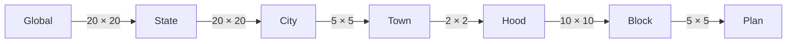

# Domain kernel — scales, tiles, nestings

Not a container. A pure TypeScript library every container imports. If this is wrong, guides mis-register and explorers see the wrong square.

Source of truth for **feet per scale** at State–Plan is the 2022 sheet [Map scales, tiles and grids](https://pathfindertools.business.blog/2022/09/21/map-scales-and-grid-squares/), transcribed below. **Global** sits above State and is defined here (it is not on that sheet). Child-grid size is **not** a global 20 × 20: N changes at each step of the ladder. The sheet also lists skip-level pairs (City↔Hood, Town↔Block); **the product ignores those** and only uses the step immediately above or below.


Build this as pure functions with golden tests before any UI (Slice 0).

## 1. What is fixed

- Every tile is a physical **20cm × 20cm** square (fits A4 / US Letter).
- Canonical unit in software: **feet**. Miles on the sheet are approximate (see footnote on the scan) and must not be used for coordinates.
- A tile is identified by `(scale, east, south)` — east/south in feet, snapped to that scale’s tile origin, then wrapped (see §2.1).
- Empty squares are not stored. Nesting math is computed, never looked up from a CMS tree.
- The world is **one Global tile**. Geography is a **donut-ring** (a torus): both axes wrap.

## 2. Scales

Canonical names: prototype `Floor` is **Plan**. Global is in the product; Extra is not (see open questions).

| Scale | 1mm (feet) | 20cm tile (feet) | 20cm tile (miles, approx.) |
| --- | ---: | ---: | ---: |
| Global | 200,000 | 40,000,000 | 7,580 |
| State | 10,000 | 2,000,000 | 380 |
| City | 500 | 100,000 | 19 |
| Town | 100 | 20,000 | 4 |
| Hood | 50 | 10,000 | 2 |
| Block | 5 | 1,000 | 1/5 |
| Plan | 1 | 200 | — |

Checks that must hold in tests:

- `tileFeet === mmFeet * 200` (because 20cm = 200mm).
- City’s “19 miles” quirk: `100_000 / 5280 ≈ 18.94`, which the sheet rounds to 19. **Store 100,000 feet**, never 19 miles.
- Global: `20 * 2_000_000 === 40_000_000`.

The prototype’s 100,000,000-foot world (50 State tiles on an edge) is **superseded**. The world is 40,000,000 feet on an edge: one Global = 20 State tiles.

### 2.1 One Global tile, donut-ring wrap

There is **exactly one** Global tile. It *is* the world: a 20cm chart of a **20 × 20** State grid. Its identity is always `{ scale: 'Global', east: 0, south: 0 }`.

Each State is **1cm** on that sheet (same patch as City-on-State). 1mm on the Global sheet is 200,000 ft ≈ **38 miles**.

The world is a **donut-ring**, not a sphere and not a finite rectangle:

- Walk off the **north** edge and you arrive on the **south** edge (same east).
- Walk off the **west** edge and you arrive on the **east** edge (same south).
- The same wrap applies at every scale. Coordinates live in `[0, 40_000_000)`.

There is no pole. North does not pinch. The four edges of the Global drawing meet their opposites; art that crosses a Global edge continues from the opposite edge of the **same** page.

Even width means no single centre State — the four central States meet in the middle.

```ts
worldFeet(): 40_000_000

wrapFeet(n: number): number {
  const w = worldFeet()
  return ((n % w) + w) % w   // [0, worldFeet)
}
```

`originOf` wraps first, then snaps. `neighbour` always returns a `TileId` in range. At Global, every neighbour is the same singleton (you are already looking at the whole ring).

## 3. Nesting is a ladder (N changes each step)

Order is fixed:

```text
Global → State → City → Town → Hood → Block → Plan
```

Each scale has **at most one parent** and **at most one child**. Scale up / scale down / guide overlays never ask the artist to pick a branch.

A child tile occupies a square patch of its parent. On paper: “X cm on the parent ↔ 20cm child tile”. In code: linear divisor `N = 20 / X`, so one parent holds an **N × N** grid of the child immediately below (N² children).

| Parent → child | Patch on parent | Linear divisor N | Children per parent | Child tile (feet) |
| --- | --- | ---: | ---: | ---: |
| Global → State | 1cm | 20 | **20 × 20 = 400** | 2,000,000 |
| State → City | 1cm | 20 | **20 × 20 = 400** | 100,000 |
| City → Town | 4cm | 5 | **5 × 5 = 25** | 20,000 |
| Town → Hood | 10cm | 2 | **2 × 2 = 4** | 10,000 |
| Hood → Block | 2cm | 10 | **10 × 10 = 100** | 1,000 |
| Block → Plan | 4cm | 5 | **5 × 5 = 25** | 200 |

Global→State and State→City are the 400-child windows. Town→Hood is four children. Do not hard-code 20, 5%, or 400 outside this table.



Invariant for every step: `parentTileFeet / N === childTileFeet`.

`parentTile` of every State is the singleton Global. `childTiles` of Global are the 400 State origins `east = col * 2_000_000`, `south = row * 2_000_000` for `col, row ∈ 0..19`.

**Ignored from the sheet:** City↔Hood (10 × 10) and Town↔Block (20 × 20). Those nest geometrically, but skipping Town or Hood would fork navigation and guides. If we ever need a skip, compose two adjacent steps; do not add extra kernel edges.

## 4. Kernel API

```ts
type Scale =
  | 'Global' | 'State' | 'City' | 'Town' | 'Hood' | 'Block' | 'Plan'

type TileId = { scale: Scale; east: number; south: number }

type Step = {
  parent: Scale
  child: Scale
  parentPatchCm: 1 | 2 | 4 | 10
  linearDivisor: 2 | 5 | 10 | 20 // N; child grid is N × N
}

tileFeet(scale: Scale): number
mmFeet(scale: Scale): number
worldFeet(): 40_000_000
wrapFeet(n: number): number     // into [0, worldFeet)
steps(): Step[]                 // the six rows above, in order
stepDown(scale: Scale): Step | null  // Plan → null
stepUp(scale: Scale): Step | null    // Global → null

originOf(pointFeet: { east: number; south: number }, scale: Scale): TileId
// Global is always { scale: 'Global', east: 0, south: 0 }

neighbour(id: TileId, dir: 'N' | 'S' | 'E' | 'W'): TileId
// wraps. Global → the same id

parentTile(id: TileId): TileId | null     // unique, or null at Global
childTiles(id: TileId): TileId[]          // N² ids, or [] at Plan
childIndex(id: TileId): { col: number; row: number } | null
cropRectInParent(id: TileId): {
  xCm: number; yCm: number; sizeCm: number
} | null
```

No `parentScale` / `childScale` arguments. Adjacent is implied.

Wrap examples that must hold in tests:

- `neighbour({ scale: 'State', east: 0, south: 4_000_000 }, 'W')` → `{ scale: 'State', east: 38_000_000, south: 4_000_000 }`
- `neighbour({ scale: 'State', east: 10_000_000, south: 0 }, 'N')` → `{ scale: 'State', east: 10_000_000, south: 38_000_000 }`
- `neighbour({ scale: 'Global', east: 0, south: 0 }, 'N')` → `{ scale: 'Global', east: 0, south: 0 }`

## 5. What this changes downstream

| Consumer | Implication |
| --- | --- |
| Tile Store | `getParent(id)`, `listChildren(id)` (0–N² existing rows). At most one Global row, at `(0, 0)`. Coverage windows wrap. |
| Map Viewer | Scale up = `parentTile` (no-op at Global). Scale down = the child cell under the last click, or a centre child (for even N, the south-east of the four cells that meet in the middle). N / S / E / W = wrapping `neighbour`. No chooser. |
| Guide Generator | One parent crop + one child mosaic. Mosaic is **N × N for the step below**, not always 20×20. 2400px canvas divides evenly by every N. Batch when N is 10 or 20 (Hood→Block, State→City, Global→State). A Global guide has no parent crop; its children are the 400 States. Features that cross a Global edge continue on the opposite edge of the same mosaic. |
| Tests | One golden case per ladder step (N, feet, crop rect). Plus wrap cases in §4. Off-by-one here is a product bug. |

## 6. Still open (does not change nestings)

- Canonical URL encoding of `east` / `south`.
- How scans register to the 20cm square (crop marks vs artist-cropped).
- Whether **Extra** exists above Global, and how it would nest. Until specified, the enum is the seven scales in §2. Extra is expected to be different (not another wrapping geographic step).
