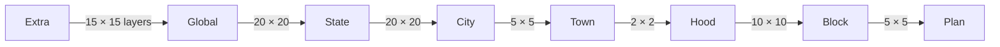

# Domain kernel — scales, tiles, nestings

Not a container. A pure TypeScript library every container imports. If this is wrong, guides mis-register and explorers see the wrong square.

Feet for State–Plan come from the 2022 sheet [Map scales, tiles and grids](https://pathfindertools.business.blog/2022/09/21/map-scales-and-grid-squares/). Child-grid size is **not** a global 20 × 20: N changes at each step of the ladder. The sheet also lists skip-level pairs (City↔Hood, Town↔Block); **the product ignores those**. Extra and Global sit above State and are defined here (they are not on that sheet).


Build this as pure functions with golden tests before any UI (Slice 0).

## 1. What is fixed

- Every tile is a physical **20cm × 20cm** square (fits A4 / US Letter).
- Canonical unit in software: **feet**. Miles on the sheet are approximate and must not be used for coordinates.
- A tile is identified by `(scale, east, south)` — see §4. Empty squares are not stored.
- Tiles at Global and below live in a **layer**. Layer is not a tile variable.
- Nesting math is computed, never looked up from a CMS tree.

## 2. Scales

Canonical names: prototype `Floor` is **Plan**.

| Scale | 1mm (feet) | 20cm tile (feet) | 20cm tile (miles, approx.) | What it is |
| --- | ---: | ---: | ---: | --- |
| Extra | — | — | — | One chart of layers (15 × 15 globes) |
| Global | 200,000 | 40,000,000 | 7,580 | One planet (~Earth diameter; 20 × 20 States) |
| State | 10,000 | 2,000,000 | 380 | |
| City | 500 | 100,000 | 19 | |
| Town | 100 | 20,000 | 4 | |
| Hood | 50 | 10,000 | 2 | |
| Block | 5 | 1,000 | 1/5 | |
| Plan | 1 | 200 | — | |

Checks that must hold in tests (Global–Plan):

- `tileFeet === mmFeet * 200` (because 20cm = 200mm).
- City’s “19 miles” quirk: `100_000 / 5280 ≈ 18.94`, which the sheet rounds to 19. **Store 100,000 feet**, never 19 miles.
- Global: `20 * 2_000_000 === 40_000_000`.
- Extra has no geographic feet. Each Extra cell *is* a layer (one Global).

### 2.1 Global → State, from Earth

A Global tile is a 20cm square standing for **one planet**. Earth’s mean diameter is 7,917.5 miles; a State tile is 2,000,000 ft ≈ 378.8 miles (sheet: 380). Twenty States along the edge is **7,576 miles** (~4% under Earth). That is close enough for the sheet’s approximate miles, and it matches the paper grid: each State is **1cm** on the Global tile (same patch as City-on-State).

**N = 20.** 1mm on the Global sheet is 200,000 ft ≈ **38 miles**.

Even width means no single centre State (the four central States meet in the middle). Extra still has the odd centre layer.

**Not chosen:** N = 21 (0.5% over Earth’s diameter, odd centre, 9.5mm cells). **Not chosen:** N ≈ 66 from Earth’s equator — 3mm State cells and a 4,356-tile mosaic.

A planet’s geography wraps inside that 20 × 20 State square: **40,000,000 feet** on an edge (prototype was 100,000,000 / 50 States).

### 2.2 Extra → Global, layers

Extra is **not** a solar system and **not** 15 planets laid out as neighbouring land. It is a 20cm chart of **different versions of the same globe**, in a geometric 15 × 15 arrangement (**225 layers**). An odd width gives a true centre: layer `{7, 7}` (0-based) is home.

Each Extra cell is one layer, and each layer has one Global tile (the whole globe). Patch on the Extra sheet: `20 / 15 ≈ 1.33cm` (13.3mm) per globe — small enough to draw as a disc or square in a mandala, large enough to see.

There is **one Extra tile** in the product (the layer chart). Layers do not wrap; the 15 × 15 is a finite arrangement. Most of the 225 Globals are never drawn.

## 3. Nesting is a ladder (N changes each step)

Order is fixed:

```text
Extra → Global → State → City → Town → Hood → Block → Plan
```

Each scale has **at most one parent** and **at most one child**. Scale up / scale down / guide overlays never ask the artist to pick a branch.

A child tile occupies a square patch of its parent. On paper: “X cm on the parent ↔ 20cm child tile”. In code: linear divisor `N = 20 / X`, so one parent holds an **N × N** grid of the child immediately below (N² children). Extra’s “patch” is a cell in the 15 × 15 **layer chart**, not a crop of continuous terrain.

| Parent → child | Patch on parent | Linear divisor N | Children per parent | Notes |
| --- | --- | ---: | ---: | --- |
| Extra → Global | 20/15 cm ≈ 13.3mm | 15 | **15 × 15 = 225** | Layers, not geography |
| Global → State | 1cm | 20 | **20 × 20 = 400** | One planet; wraps |
| State → City | 1cm | 20 | **20 × 20 = 400** | |
| City → Town | 4cm | 5 | **5 × 5 = 25** | |
| Town → Hood | 10cm | 2 | **2 × 2 = 4** | |
| Hood → Block | 2cm | 10 | **10 × 10 = 100** | |
| Block → Plan | 4cm | 5 | **5 × 5 = 25** | |

Do not hard-code 20, 5%, or 400 outside this table. Worst-case mosaic is **400** (Global→State and State→City), then Extra→Global (225).



Invariant for geographic steps (Global→Plan): `parentTileFeet / N === childTileFeet`. Extra is excluded from that invariant.

**Ignored from the sheet:** City↔Hood (10 × 10) and Town↔Block (20 × 20). If we ever need a skip, compose two adjacent steps; do not add extra kernel edges.

## 4. Layer vs tile identity

A tile’s own variables are **scale, east, and south**. Layer is not one of them.

Layer is *which globe-drawing you are in*. Extra’s 15 × 15 chart **is** the map of layers. Global and below are stored *on* a layer; Extra is the chart itself.

```ts
type LayerId = { east: number; south: number } // Extra chart cell, integers 0..14

type TileId = {
  scale: Scale
  east: number   // feet at Global–Plan; unused at Extra
  south: number
}
```

Rules:

- Extra: a singleton. No layer. `east` / `south` unused. Scale-down picks a **layer** (an Extra cell), then opens that layer’s Global.
- Global: one tile per layer, always `{ scale: 'Global', east: 0, south: 0 }`. No N/S/E/W at Global — neighbours would be other layers, which is Extra. Scale up instead.
- State–Plan: `east` / `south` in feet, snapped to that scale’s origin, wrapping in `[0, 40_000_000)` **within the current layer**.
- Default / “start here” layer: **`{ east: 7, south: 7 }`**, the centre of the Extra chart.

Lookups take `(layer, tileId)` for Global and below. Extra lookups are just the Extra tile.

`parentTile` of a State is that layer’s Global. `childTiles` of Extra are 225 layers (most with no Global art). `childTiles` of a Global are 400 State origins on that layer.

## 5. Kernel API

```ts
type Scale =
  | 'Extra' | 'Global' | 'State' | 'City'
  | 'Town' | 'Hood' | 'Block' | 'Plan'

type Step = {
  parent: Scale
  child: Scale
  linearDivisor: 2 | 5 | 10 | 15 | 20
  parentPatchCm: number // 20 / N; Extra is 20/15 cm, others are whole millimetres or centimetres
}

tileFeet(scale: Scale): number | null  // null at Extra
mmFeet(scale: Scale): number | null
worldFeet(): 40_000_000
centreLayer(): LayerId               // {7, 7}
steps(): Step[]
stepDown(scale: Scale): Step | null  // Plan → null
stepUp(scale: Scale): Step | null    // Extra → null

originOf(layer: LayerId, pointFeet: { east: number; south: number }, scale: Scale): TileId
neighbour(id: TileId, dir: 'N' | 'S' | 'E' | 'W'): TileId | null
// null at Extra (singleton) and at Global (use scale up / Extra)

parentTile(layer: LayerId, id: TileId): TileId | null
childTiles(layer: LayerId, id: TileId): TileId[]
childIndex(id: TileId): { col: number; row: number } | null
cropRectInParent(id: TileId): {
  xCm: number; yCm: number; sizeCm: number
} | null
```

Wrap feet with `modulo 40_000_000` for State–Plan. Do not wrap Extra cells.

## 6. What this changes downstream

| Consumer | Implication |
| --- | --- |
| Tile Store | Tiles at Global and below belong to a `layer`. `TileId` is `(scale, east, south)` only. Extra is at most one row, no layer. |
| Map Viewer | Current **layer** is viewing context (default centre). Scale up from Global opens Extra (highlight that layer’s cell). Scale down from Extra selects that layer and opens its Global. No N/S/E/W on Extra or Global. |
| Guide Generator | Mosaic N × N for the step below. Canvas **2400px** (20cm at ~300dpi); every N (2, 5, 10, 15, 20) divides evenly. Batch when N ≥ 10 (Hood→Block 100, Extra 225, Global→State and State→City 400). |
| Tests | One golden case per ladder step. Extra: cell `(7,7)` is the centre layer. Global: 20 State origins wrap within a layer. |

## 7. Still open (does not change nestings)

- Canonical URL encoding of layer (separate from the tile path) and of `east` / `south`.
- How scans register to the 20cm square (crop marks vs artist-cropped).
- Whether Extra ever needs a second chart (v1: no).
