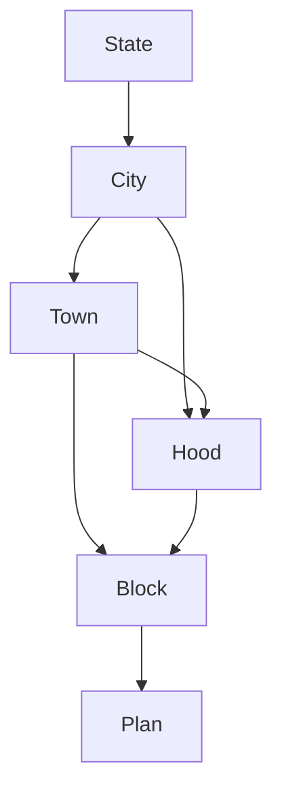

# Domain kernel — scales, tiles, nestings

Not a container. A pure TypeScript library every container imports. If this is wrong, guides mis-register and explorers see the wrong square.

Source of truth for **how scales nest** is the 2022 sheet [Map scales, tiles and grids](https://pathfindertools.business.blog/2022/09/21/map-scales-and-grid-squares/), transcribed below. The earlier architecture draft assumed every parent was a **20 × 20** child grid (400 children). That is only true for some scale pairs.


Build this as pure functions with golden tests before any UI (Slice 0).

## 1. What is fixed

- Every tile is a physical **20cm × 20cm** square (fits A4 / US Letter).
- Canonical unit in software: **feet**. Miles on the sheet are approximate (see footnote on the scan) and must not be used for coordinates.
- A tile is identified by `(scale, east, south)` — east/south in feet, snapped to that scale’s tile origin.
- Empty squares are not stored. Nesting math is computed, never looked up from a CMS tree.

## 2. Scales

Canonical names from the sheet. The prototype’s `Floor` is **Plan**. `Extra` and `Global` are not on this sheet (see open questions).

| Scale | 1mm (feet) | 20cm tile (feet) | 20cm tile (miles, approx.) |
| --- | ---: | ---: | ---: |
| State | 10,000 | 2,000,000 | 380 |
| City | 500 | 100,000 | 19 |
| Town | 100 | 20,000 | 4 |
| Hood | 50 | 10,000 | 2 |
| Block | 5 | 1,000 | 1/5 |
| Plan | 1 | 200 | — |

Checks that must hold in tests:

- `tileFeet === mmFeet * 200` (because 20cm = 200mm).
- City’s “19 miles” quirk: `100_000 / 5280 ≈ 18.94`, which the sheet rounds to 19. **Store 100,000 feet**, never 19 miles.

The prototype’s 100,000,000-foot world is consistent with this table: `100_000_000 / 2_000_000 = 50` State tiles along an edge.

## 3. Nesting is a graph, not a 20×20 ladder

A child tile occupies a **square patch** of a parent tile. The patch size depends on the **scale pair**, not on a global constant.

On paper: “X cm on the parent ↔ 20cm child tile”. In code: linear divisor `N = 20 / X`, so one parent holds an **N × N** grid of that child (N² children).

| Parent ↔ child | Patch on parent | Linear divisor N | Children per parent | Child tile (feet) |
| --- | --- | ---: | ---: | ---: |
| State ↔ City | 1cm | 20 | **20 × 20 = 400** | 100,000 |
| City ↔ Town | 4cm | 5 | **5 × 5 = 25** | 20,000 |
| City ↔ Hood | 2cm | 10 | **10 × 10 = 100** | 10,000 |
| Town ↔ Hood | 10cm | 2 | **2 × 2 = 4** | 10,000 |
| Town ↔ Block | 1cm | 20 | **20 × 20 = 400** | 1,000 |
| Hood ↔ Block | 2cm | 10 | **10 × 10 = 100** | 1,000 |
| Block ↔ Plan | 4cm | 5 | **5 × 5 = 25** | 200 |

Only State→City and Town→Block are 400-child windows. Town→Hood is four children. Do not hard-code 20, 5%, or 400 anywhere outside this table.

It is also **not a single zoom stack**. A scale can have more than one parent and more than one child:

```text
State
  └── City          (20 × 20)
        ├── Town    (5 × 5)
        │     ├── Hood   (2 × 2)
        │     │     └── Block  (10 × 10)
        │     │           └── Plan  (5 × 5)
        │     └── Block  (20 × 20)
        │           └── Plan  (5 × 5)
        └── Hood    (10 × 10)
              └── Block  (10 × 10)
                    └── Plan  (5 × 5)
```



Consequences:

- `parentOf(tile)` is meaningless without a **parent scale**. Hood sits inside both a Town (half the parent) and a City (one tenth).
- `childrenOf(tile)` is meaningless without a **child scale**. A City tile contains 25 Towns *and* 100 Hoods.
- Guide overlays and viewer “scale up / scale down” must pick a **scale pair** (or show a chooser when more than one pair applies).

Invariant for every pair: `parentTileFeet / N === childTileFeet`.

## 4. Kernel API

Suggested shape — names can move; the pair-wise nature cannot.

```ts
type Scale = 'State' | 'City' | 'Town' | 'Hood' | 'Block' | 'Plan'

type TileId = { scale: Scale; east: number; south: number }

type ScalePair = {
  parent: Scale
  child: Scale
  parentPatchCm: 1 | 2 | 4 | 10
  linearDivisor: 2 | 5 | 10 | 20 // N; child grid is N × N
}

tileFeet(scale: Scale): number
mmFeet(scale: Scale): number
nestings(): ScalePair[]
pairing(parent: Scale, child: Scale): ScalePair | null
parentsOf(scale: Scale): Scale[]
childrenOfScale(scale: Scale): Scale[]

originOf(pointFeet: { east: number; south: number }, scale: Scale): TileId
neighbour(id: TileId, dir: 'N' | 'S' | 'E' | 'W'): TileId

parentTile(id: TileId, parentScale: Scale): TileId
childTiles(id: TileId, childScale: Scale): TileId[] // length N²
childIndex(id: TileId, parentScale: Scale): { col: number; row: number }
cropRectInParent(id: TileId, parentScale: Scale): {
  xCm: number; yCm: number; sizeCm: number
}
```

`childTiles` / `cropRectInParent` throw (or return `null`) if the two scales are not a row in the nesting table. No inferred “skip a generation” math: City→Block is Town→Block or Hood→Block, never a made-up 100×100.

## 5. What this changes downstream

| Consumer | Implication |
| --- | --- |
| Tile Store | `listChildren(id, childScale)`, `listParents(id)` (0–2 rows). Coverage windows are independent of N. |
| Map Viewer | “Scale up/down” offers every valid pair. City down: Town *or* Hood. Hood up: Town *or* City. |
| Guide Generator | Mosaic is **N × N for a chosen child scale**, not always 20×20. Parent crop uses that pair’s patch (1, 2, 4, or 10cm). 2400px canvas still divides evenly by 2, 5, 10, and 20. Worst-case stitch is still 400 tiles (State→City, Town→Block); batch only those. |
| Tests | One golden case per row in the nesting table (N, feet, crop rect). Off-by-one here is a product bug. |

## 6. Still open (does not change nestings)

- Canonical URL encoding of `east` / `south`.
- How scans register to the 20cm square (crop marks vs artist-cropped).
- Whether **Extra** and **Global** exist above State, and how they nest. Until specified, the enum is the six scales in §2.
- World wrapping policy at the 100,000,000-foot edge (prototype already loops).
